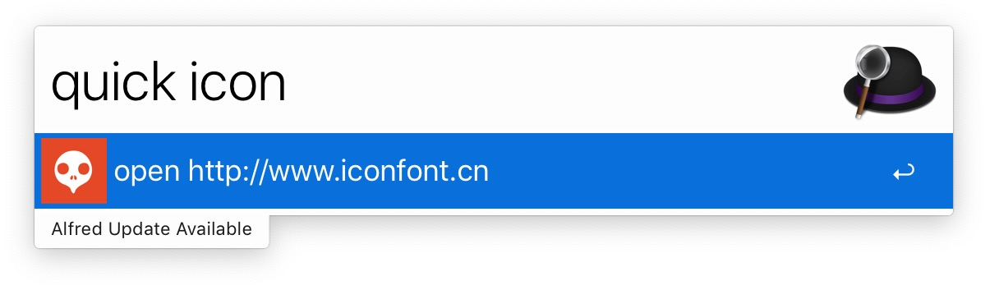

# Alfred Workflow

### youdao
* 来自 [wensonsmith/YoudaoTranslate](https://github.com/wensonsmith/YoudaoTranslate),有道翻译
* `keyword: yd`

### QuickTo
* 快速打开应用，现在只写了快速打开指定网站,`json格式化校验`,`在线正则表达式测试`,`iconfont`等
* 添加网站可以直接添加代码，如下：

	```
	if [[ "wanandroid" == ${q}* ]];then
	genItem "json" "open http://www.wanandroid.com" "imgs/wanandroid.png"
	fi
	```
* `keyword: quick`


### short_url
* 短网址，支持`t.cn`,`suo.im`,`tiny.url`,`x.co`,`dwz.cn`
* 修改自[`shorten-url`](http://www.packal.org/workflow/shorten-url)
* `keyword: short`

